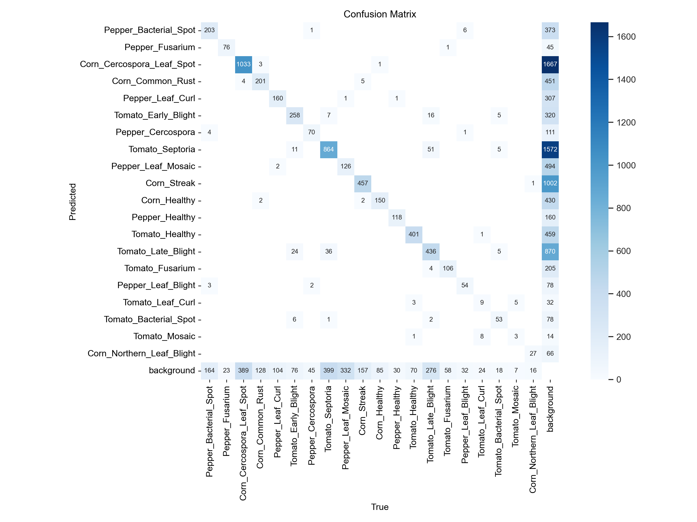

# YOLO-Model-Performance-on-Crop-Disease-Detection
YOLO Model Performance Comparison: RTDETR vs. YOLO 11

 
    
    
    

## Overview

Crop diseases are on the rise, exacerbated by climate change and the lack of access to advanced agricultural technologies. Diseases such as tomato leaf curl virus and pepper blight have significantly impacted the yields of these essential crops.

This repository aims to compare the performance of two advanced object detection models, RTDETR and YOLO 11, for crop disease identification. By evaluating these models, we aim to determine their effectiveness in detecting multiple diseases in three critical crops: corn, pepper, and tomatoes.

## Objective

The primary goal of this study is to develop robust machine learning models that:

Accurately predict and identify multiple crop diseases.

Operate efficiently on edge devices, such as entry-level smartphones used by subsistence farmers in Africa.

By leveraging these deep learning models, we hope to enhance agricultural productivity, ensure food security, and promote sustainable farming practices.

## Dataset

The dataset used in this study can be found on [Zindi](https://zindi.africa/competitions/ghana-crop-disease-detection-challenge/data). The dataset consists of images of diseased corn, pepper, and tomato crops. Each image is labeled with one or more diseases, providing a multi-label classification problem. The dataset is split into:

Training Set: Used to train the models.

Validation Set: Used for hyperparameter tuning.

## Models Compared

### RTDETR: A real-time object detection model designed for high efficiency and accuracy.

### YOLO 11: The latest iteration of the YOLO (You Only Look Once) family, optimized for real-time detection with improved accuracy.

## Evaluation Metrics

To compare the models fairly, we use the following evaluation metrics:

__Mean Average Precision (mAP50):__ Measures overall detection accuracy at an Intersection over Union (IoU) threshold of 0.5.

__Confusion Matrix:__ A confusion matrix for object detection and classification is a performance measurement tool that evaluates the accuracy of a model in predicting both the presence of objects (localization) and their correct class labels (classification).

## Results
| Model   | mAP@50 | mAP@50-95 |
|---------|--------|----------|
| YOLO11l | 0.416  | 0.186     |
| RT-DETR-L  | 0.453    | 0.178     |

<h4>Confusion Matrix</h4>

 
    

        <h3 style="margin: 0;">YOLO11l</h3>
        <h3 style="margin: 0;">RT-DETR-L</h3>
    

    

        
        
    

